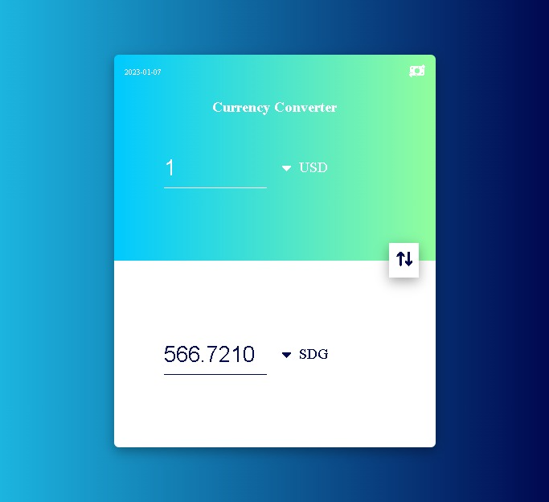

# Currency Converter

This App was built to practice working with curency API

## Overview

### The challenge

Users should be able to:

- type in values to change from one currency to another
- choose the types and swicth between them smoothly

### Screenshot

### Links

- [Live Site URL](https://husamasaad.github.io/currency-converter/)

## My process

### Built with

- Semantic HTML5 markup
- CSS custom properties
- Flexbox
- CSS Grid
- Mobile-first workflow

## Author

- github Profile - [Husam Asaad](https://github.com/husamasaad)
